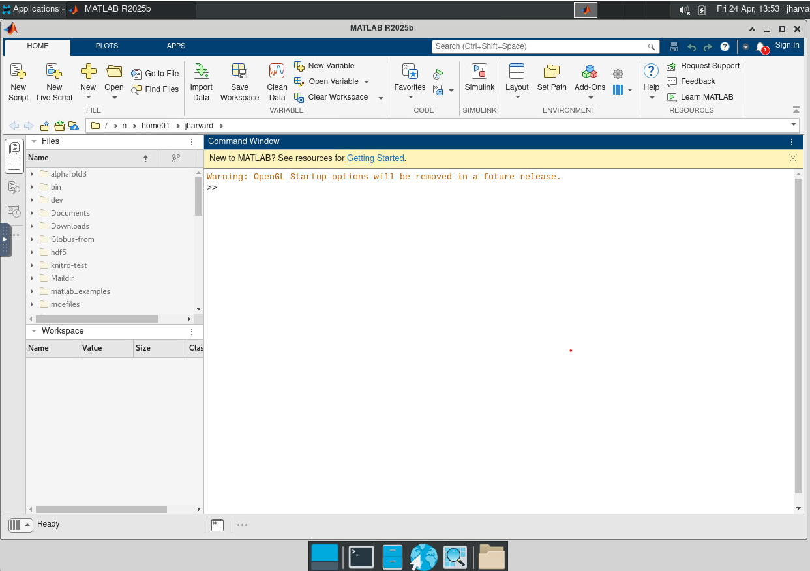

# Open OnDemand Matlab

<!-- Describe the app from a user's perspective. This is a simplied version of Overview -->
## FASRC users

Matlab is an Open OnDemand app that launches Matlab as an interactive session on
a compute node. Matlab is a computing platform that is used for engineering and
scientific applications like data analysis, signal and image processing, control
systems, wireless communications, and robotics.

<!-- Link any relevant FASRC docs -->
<!-- ### Using [app name] -->
### FASRC documentation:

- [MATLAB on FASRC clusters](https://docs.rc.fas.harvard.edu/kb/matlab/)
- [Parallel MATLAB with PCT and
  DCS](https://docs.rc.fas.harvard.edu/kb/parallel-matlab-pct-dcs/)

<!-- Link how to create Sandbox -->
### Sandbox app

For how to create a Sandbox app, see the [Developing your own app using Open
OnDemand](https://docs.rc.fas.harvard.edu/kb/developing-apps-on-ood/)
documentation.

## Appverse overview

> [!NOTE]  
> This section is intended for sys-admins, developers, and power users.

Matlab is an Open OnDemand Batch Connect app that launches Matlab as an
interactive desktop session on HPC clusters. It is designed for researchers who
need data Matlab is a computing platform that is used for engineering and
scientific applications like data analysis, signal and image processing, control
systems, wireless communications, and robotics. 

This app uses the Batch Connect `basic` template with Slurm.

- **Batch Connect template:** `basic`
- **Scheduler:** Slurm

## Screenshots

<!-- A screenshot helps deployers verify their installation and helps users understand what they'll get. -->
<!-- Place images in a screenshots/ or docs/ directory. -->



## Features

<!-- List the key capabilities specific to THIS OOD app (not the upstream software). -->

- Launches Matlab via VNC desktop on compute nodes
- Supports CPU and GPU execution
- Configurable partition, memory, CPU cores, GPU cards, and wall time
- Additional Slurm options pass-through (long format)
- Reservation support and optional Slurm account
- Email notification on job start
- Lmod module-based

## Requirements

### Compute Node Software

- Matlab Lmod module and Matlab license
- Window manager XFCE
- [Slurm](https://slurm.schedmd.com/) job scheduler

### Open OnDemand

- Open OnDemand v3.0+
- [Slurm](https://slurm.schedmd.com/) job scheduler
- [Lmod](https://lmod.readthedocs.io/en/latest/)

## App Installation

Please see the [References section](#software-installation) below for
instructions on how to install the software that is launched by this App.

### 1. Clone the repository

```bash
# Batch Connect apps:
cd /var/www/ood/apps/sys

git clone https://github.com/fasrc/ood-matlab.git
cd ood-matlab

# Pin to a release (recommended)
git checkout v1.0.0
```

### 2. Configure for your site

<!-- Point deployers to the ONE place they need to edit. -->
<!-- Batch Connect apps: document form.yml attributes -->

#### `form.yml` attributes

Edit `form.yml` and update these values for your cluster:

| Attribute | Description | FASRC settings | Change to |
|-----------|-------------|---------| -----------|
| `cluster` | Target cluster ID | `odyssey` | Your cluster name |
| `bc_num_hours` | Maximum wall time (HH:MM:SS) | user-defined; default: `04:00:00` | Your preferred default time |
| `bc_num_cores` | Number of cores | user-defined; default `1` | Your preferred default number of cores |
| `bc_queue` | Default scheduler partition | user-defined; default: `shared` | Your preferred partition |
| `extra_slurm` | Extra slurm option (long-format) | user-defined | Remove if using aother scheduler |
| `custom_num_gpus` | Number of GPUs | user-defined; default `0` | Your preferred default number of GPUs |
| `memory` | Memory per job (GB) | user-defined; default: `8` | Your preferredmemory allocation |
| `matlab_version` | Matlab module to load on compute node | Multiple versions; e.g. `matlab/R2025b-fasrc01` | Your `matlab` module |

#### `manifest.yml` attributes

Edit `manifest.yml` and update these values for your organization:

| Attribute | Change to |
|-----------|-----------|
| `description` | Your cluster and your documentation |

### 3. Verify

<!-- Batch Connect: -->
No OOD restart is needed (Batch Connect apps are detected automatically). Visit
your OOD dashboard and look for **Matlab** under **Interactive Apps > Desktop
Apps**.

## Troubleshooting

### Job starts but app doesn't appear (Batch Connect)

1. Check the job's `output.log` in `~/ondemand/data/sys/YOUR-APP/`
2. Verify the module loads correctly: `module load software/1.0`
3. For VNC apps, verify the window manager is installed: `which xfwm4`

### "Module not found" error

The module name in `form.yml` doesn't match your system. Run `module spider
software` to find the correct name and update the `modules` attribute.

### Connection timeout

The app may need more time to start. Increase the connection timeout or check
that the compute node can open the required port.

## Testing

<!-- Where has this app been deployed and verified? -->

| Site | OOD Version | Scheduler | Status |
|------|-------------|-----------|--------|
| FASRC | 3.1 | Slurm 25.11 | Tested |
| FASRC | 4.0 | Slurm 25.11 | Tested |

<!-- How can a deployer verify it works? -->

To verify your installation:

1. Launch the app from the OOD dashboard with default settings
2. Confirm the application loads in the browser

## Known Limitations

<!-- Be honest about what doesn't work or hasn't been tested. -->

- Multi-node jobs are not supported
- Only tested on Centos 7 and Rocky 8; may not work on Ubuntu.

## Contributing

Contributions are welcome. To contribute:

1. Fork this repository.
2. Create a feature branch (`git checkout -b feature/my-improvement`).
3. Submit a pull request with a description of your changes.

For bugs or feature requests, [open an issue](https://github.com/fasrc/ood-matlab/issues).

This app is part of the [OOD Appverse](https://ondemand.connectci.org/affinity-groups/ood-appverse). Join the [Appverse Affinity Group](https://ondemand.connectci.org/affinity-groups/ood-appverse) to connect with other contributors.

## References

<!-- Credit upstream projects and any code you borrowed. -->

- [MATLAB](https://www.mathworks.com/products/matlab.html) — the application launched by this OOD app.
- [Open OnDemand](https://openondemand.org/) — the HPC portal framework.

### Software Installation

- [MATLAB installation
  guide](https://www.mathworks.com/help/install/ug/install-products-with-internet-connection.html).

## License

[MIT License](LICENSE).

## Acknowledgments

This work is supported by [FASRC](https://www.rc.fas.harvard.edu) at Harvard
Univesity.
